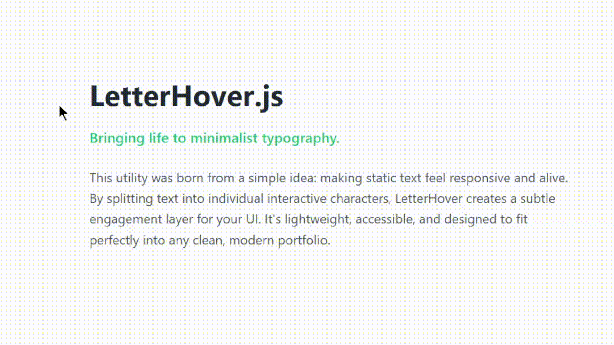

# LetterHover.js 💫

A lightweight, zero-dependency JavaScript utility that transforms static text into interactive, letter-by-letter hover experiences. Perfect for landing pages, headers, and creative portfolios.



## Features

- 🚀 **Lightweight:** Minimal footprint, no external dependencies.
- ♿ **Accessible:** Automatically adds `aria-labels` so screen readers don't struggle with split text.
- ⚡ **Performant:** Uses **Event Delegation** to handle hundreds of letters with a single event listener.
- 🛠 **Customizable:** Easily change colors, durations, and classes via a simple configuration object.

---

## Installation

Download `letter_hover.js` and include it in your project as an ES6 module.

## Quick Start

### 1. HTML Structure

Add a specific class to the text elements you want to animate:

```html
<h1 class="text-changing">Hover over this text!</h1>
```

### 2. Basic Usage

Initialize the effect with your preferred settings:

```javascript
import { initLetterHover } from './letter_hover.js';

initLetterHover('.text-changing', {
  hoverColor: '#3498db',
  defaultColor: 'inherit',
  duration: 400
});
```

### 3. Recommended CSS

To make the transitions smooth, add a small snippet to your stylesheet:

```css
.letter {
  display: inline-block;
  transition: color 0.3s ease;
  cursor: default;
}
```

---

## API Options

| Option | Type | Default | Description |
| :--- | :--- | :--- | :--- |
| `selector` | `string` | `'.text-changing'` | CSS selector for target elements. |
| `hoverColor` | `string` | `'#ff0055'` | Color of the letter on hover. |
| `defaultColor`| `string` | `'inherit'` | Color the letter returns to. |
| `duration` | `number` | `350` | Time (ms) before color reverts. |
| `className` | `string` | `'letter'` | CSS class assigned to each span. |

---

## Accessibility (A11y)

Unlike many "text-splitting" scripts, **LetterHover.js** cares about accessibility. It preserves the original text in an `aria-label` and hides the individual spans from screen readers using `aria-hidden="true"`. This ensures your site remains readable for everyone.
